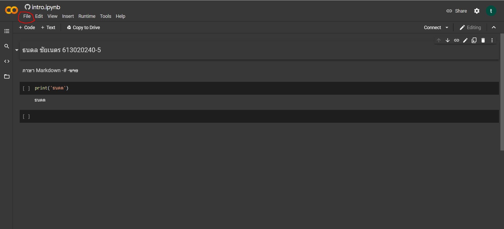
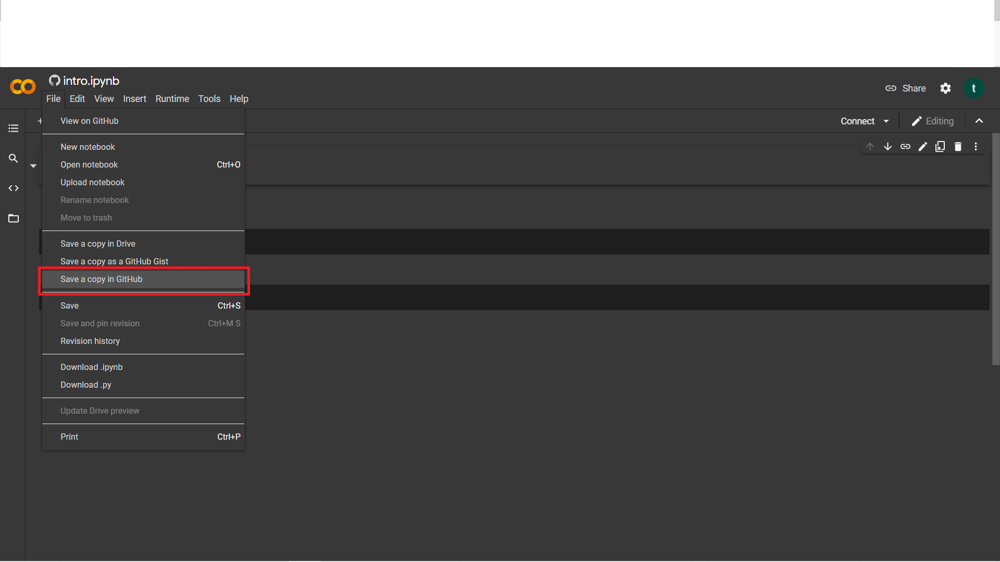
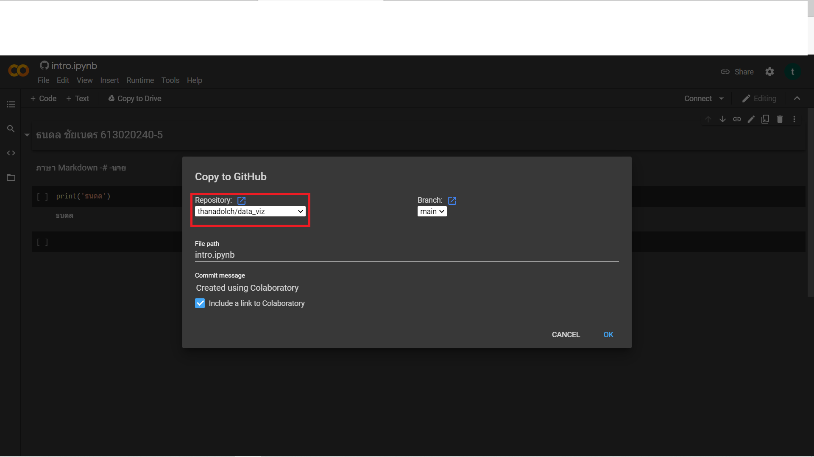
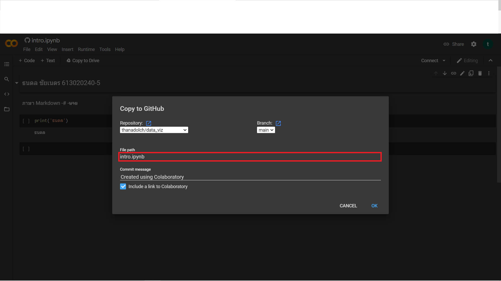
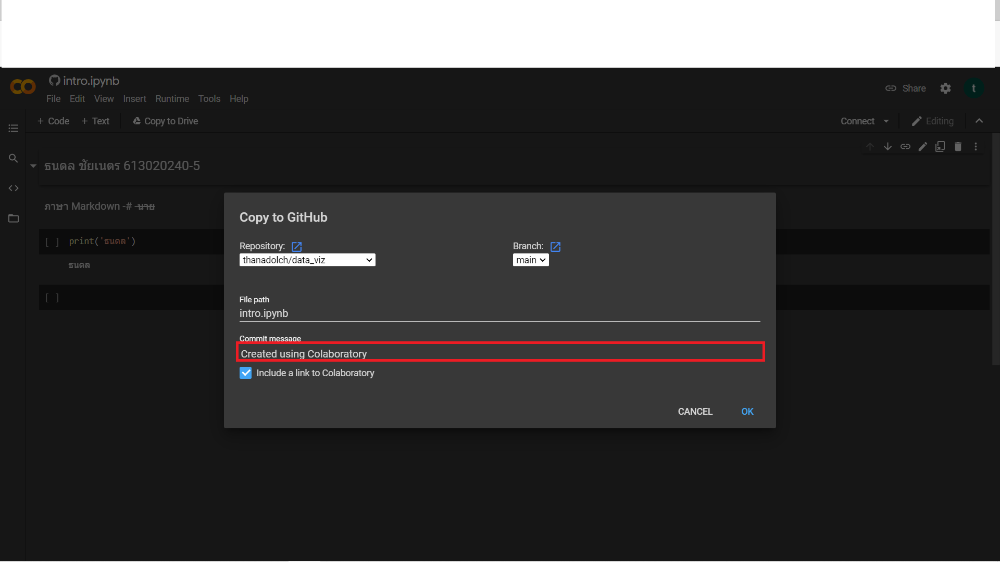

# data_viz
ธนดล ชัยเนตร 613020240-5  
 
## วิธีบันึกงานจากgoogle colab ไว้ใน github  

1.คลิกที่ File 

2.เลือก save a copy in github 

3.เลือกไฟล์ที่จะเซฟโปรเจค 

4.ตั้งชื่อโปรเจค 

5.อธิบายเกี่ยวกับโปรเจค จากนั้นคลิก OK
